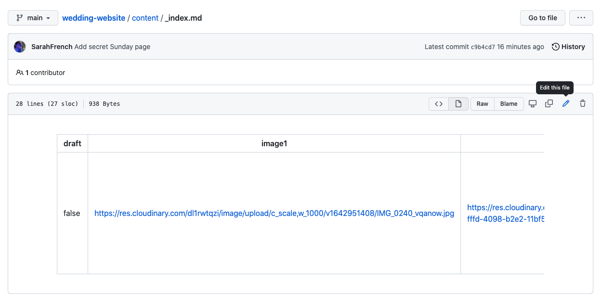
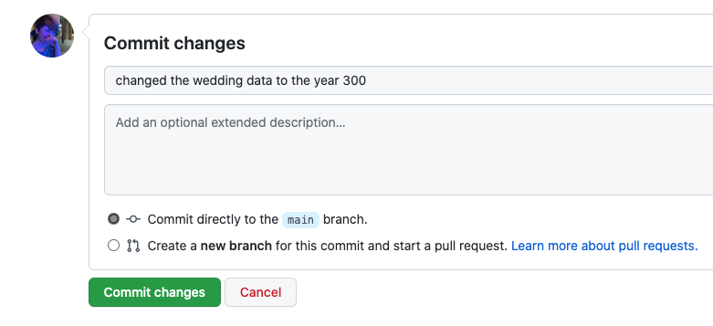

# Hi Hugo

To edit content in the website go to [the `/content` folder of this repo in your web browser](https://github.com/SarahFrench/wedding-website/tree/main/content) and edit files there. The `_index.md` file controls some content in the homepage, and the `sunday.md` file controls text content in the page about what we're doing on Sunday.

## Steps

If you wanted to update the day of the wedding you would do these steps:

1. Go to [the `/content` folder of this repo in your web browser](https://github.com/SarahFrench/wedding-website/tree/main/content)
2. Click on the file you want to edit, in this case `_index.md`
3. Click the pencil icon in the top right, as shown in this screenshot:

    

4. Make your edits to the file content in your browser window
5. Scroll down to the section under where you've been editing the file, you'll see a section like this:

    

6. In the top field add a short description of what you changed, e.g. in this example I've changed our wedding date so it 100% misses covid restrictions
7. Make sure the option 'Commit directly to `main` branch` is selected, like in the screenshot above
8. Click the green Commit Changes button
9. Wait a few mins and visit the site - changes should be there!

### Scary 10th step

10. If the website has an error message... pls ask me to fix it
